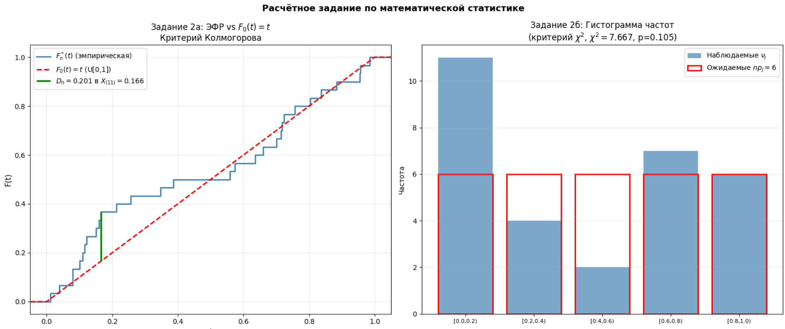

ЗАДАНИЕ 1: ДОВЕРИТЕЛЬНЫЕ ИНТЕРВАЛЫ (n=50)
============================================================

**Выборочное среднее: = 1.8730** 

**Выборочная дисперсия S² = 0.9442**

**Несмещённая дисперсия S₀²= 0.9816**

**S₁² при известном a=2.0 = 0.9603**

--- а) ДИ для a, σ²=1.1 известно ---
  τ = Φ⁻¹(1-ε/2) = Φ⁻¹(0.9) = 1.2816
  δ = τ · σ/√n = 1.2816 · 1.0488/√50 = 0.1901
  ДИ: [1.8730 - 0.1901, 1.8730 + 0.1901]
  
  **ДИ: [1.6829, 2.0630]
  Истинное a=2.0: ПОПАЛО**

--- б) ДИ для a, σ² неизвестно ---
  t = T⁻¹_{n-1}(1-ε/2) = T⁻¹_{49}(0.9) = 1.2991
  δ = t · S₀/√n = 1.2991 · 0.9816/√50 = 0.1803
  ДИ: [1.8730 - 0.1803, 1.8730 + 0.1803]
  
  **ДИ: [1.6926, 2.0533]
  Истинное a=2.0: ПОПАЛО**

--- в) ДИ для σ², a=2.0 известно ---
  nS₁² = 50 · 0.9603 = 48.0170
  t1 = χ²⁻¹_{50}(ε/2)   = χ²⁻¹_{50}(0.1) = 37.6886
  t2 = χ²⁻¹_{50}(1-ε/2) = χ²⁻¹_{50}(0.9) = 63.1671
  ДИ: [48.0170/63.1671, 48.0170/37.6886]
 
  **ДИ: [0.7602, 1.2740]
  Истинное σ²=1.1: ПОПАЛО**

--- г) ДИ для σ², a неизвестно ---
  nS² = 50 · 0.9442 = 47.2100
  t1 = χ²⁻¹_{49}(ε/2)   = χ²⁻¹_{49}(0.1) = 36.8182
  t2 = χ²⁻¹_{49}(1-ε/2) = χ²⁻¹_{49}(0.9) = 62.0375
  ДИ: [47.2100/62.0375, 47.2100/36.8182]
  
  **ДИ: [0.7610, 1.2822]
  Истинное σ²=1.1: ПОПАЛО**

ЗАДАНИЕ 2а: КРИТЕРИЙ КОЛМОГОРОВА (n=30, H0: U[0,1])
============================================================

D_n = 0.2007  (максимум при k=11, X_(11)=0.166)

Статистика: d = √n · D_n = √30 · 0.2007 = 1.0991

Порог: K(c) = 1-ε = 0.8
  c = K⁻¹(0.8) = 5.0000

**Решение: d=1.0991 < c=5.0000
  δ = 0  =>  Принимаем H0**

**РДУЗ: ε\* = 1 - K(d) = 1 - K(1.0991) = 0.1784 
    ε\* ≥ 0.10 => принимаем H0**

ЗАДАНИЕ 2б: КРИТЕРИЙ ПИРСОНА (n=30, H0: U[0,1])
============================================================

шириной 0.2:

Шаг 2. Считаем ν_j — число наблюдений в каждой ячейке:
  ν_1: [0.0, 0.2) => 11 наблюдений
  ν_2: [0.2, 0.4) => 4 наблюдений
  ν_3: [0.4, 0.6) => 2 наблюдений
  ν_4: [0.6, 0.8) => 7 наблюдений
  ν_5: [0.8, 1.0] => 6 наблюдений

 p_j = F0(t_j) - F0(t_{j-1}) = 0.2 для всех j  (т.к. F0(t)=t)
  np_j = 30 · 0.2 = 6.0 для всех j

Статистика χ² = Σ (ν_j - np_j)² / np_j:
  j=1: (11 - 6.0)² / 6.0 = 4.1667
  j=2: (4 - 6.0)² / 6.0 = 0.6667
  j=3: (2 - 6.0)² / 6.0 = 2.6667
  j=4: (7 - 6.0)² / 6.0 = 0.1667
  j=5: (6 - 6.0)² / 6.0 = 0.0000
  χ² = 7.6667

**Порог: χ²⁻¹_{k-1}(1-ε) = χ²⁻¹_{4}(0.8) = 5.9886**

**Решение: χ²=7.6667 ≥ c=5.9886
  δ = 1  =>  Отвергаем H0**

**Шаг 7. РДУЗ: ε\* = 1 - χ²_4(7.6667) = 0.1046
  ε\* ≥ 0.10 => принимаем H0**

 

ЗАДАНИЕ 3: ХАРАКТЕРИСТИКИ ПОДВЫБОРОК
============================================================

Подвыборка X (n=20):
  X̄  = 2.1986
  S²  = 1.0395  (смещённая)
  S₀² = 1.0943  (несмещённая)

Подвыборка Z (m=30):
  Z̄  = 1.6559
  S²  = 0.7628  (смещённая)
  S₀² = 0.7891  (несмещённая)

ЗАДАНИЕ 3а: КРИТЕРИЙ ФИШЕРА (H0: σ1²=σ2²)
============================================================

Статистика: d = S₀²(X)/S₀²(Z) = 1.0943/0.7891 = 1.3867

Квантили F_{19,29}:
  f1 = F⁻¹(ε/2)   = F⁻¹(0.1)   = 0.5672
  f2 = F⁻¹(1-ε/2) = F⁻¹(0.9) = 1.6849

Критическая область: d < 0.5672 или d > 1.6849
  d = 1.3867

**Решение: δ = 0  =>  Принимаем H0**

ЗАДАНИЕ 3б: КРИТЕРИЙ СТЬЮДЕНТА (H0: a1=a2, σ1²=σ2²)
============================================================

Числитель: |X̄ - Z̄| · √(n+m-2)
  |2.1986 - 1.6559| · √(20+30-2)
  = 0.5427 · √48 = 0.5427 · 6.9282 = 3.7602

Знаменатель: √((1/n + 1/m)·(nS²(X) + mS²(Z)))
  nS²(X) = 20·1.0395 = 20.7909
  mS²(Z) = 30·0.7628 = 22.8844
  nS²(X)+mS²(Z) = 43.6753
  1/n+1/m = 1/20+1/30 = 0.0500+0.0333 = 0.0833
  знаменатель = √(0.0833·43.6753) = √3.6396 = 1.9078

d = 3.7602 / 1.9078 = 1.9710

Порог: t = T⁻¹_{48}(1-ε/2) = T⁻¹_{48}(0.9) = 1.2994

**Решение: |d|=1.9710 ≥ t=1.2994
  δ = 1  =>  Отвергаем H0**

